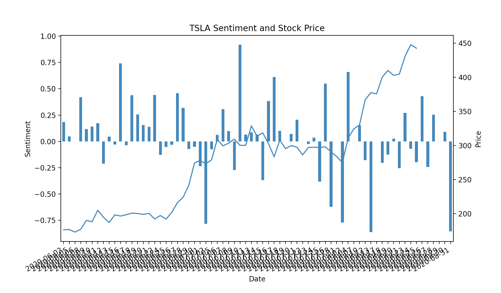
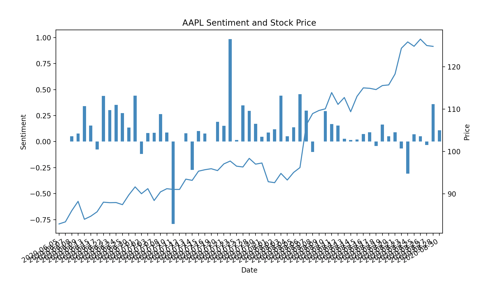

# WSB Sentiment Analysis

Sentiment vs. stock price for TSLA over the past 120 days. 
`python scripts/visualize.py --date 90d --limit 1000 --stock TSLA`

Sentiment vs. stock price for AAPL over the past 120 days. 
`python scripts/visualize.py --date 90d --limit 1000 --stock AAPL`

See more in [test](test/).

## Idea

I scraped posts and comments with stock ticker information from r/wallstreetbets. I used this data to perform sentiment analysis on each submission to get an average sentiment for a stock at various timeframes. I matched this up with stock/option movements to try to infer future movements.

## Todo

* ~~Refactor code~~
  * ~~Any subreddit~~
  * ~~Write as script and save df to output directory~~
* Visualize over options data
* Try inference based on WSB
